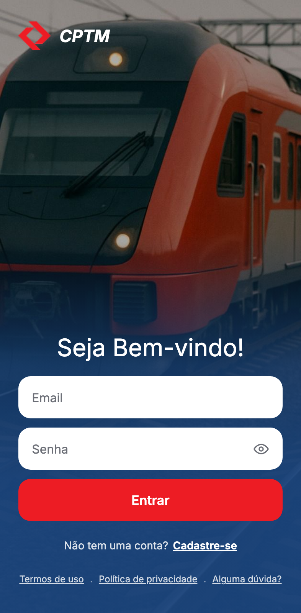
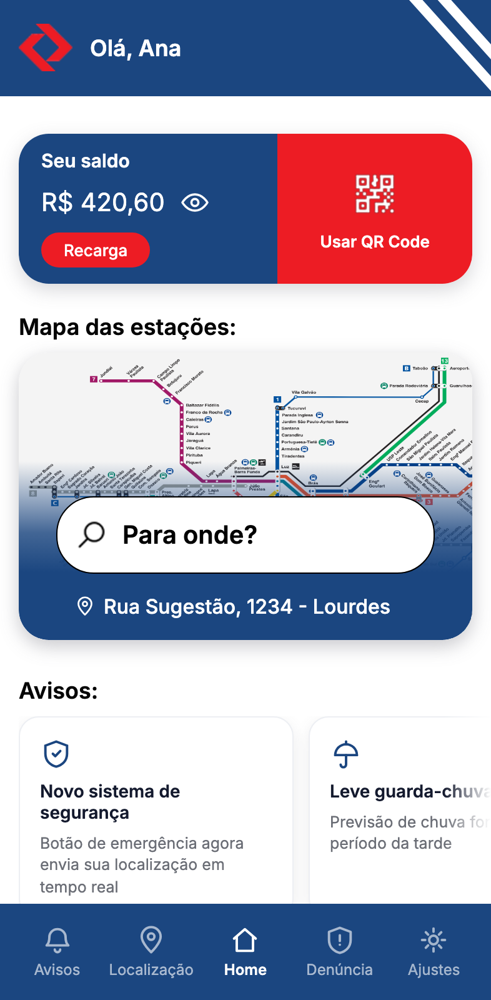
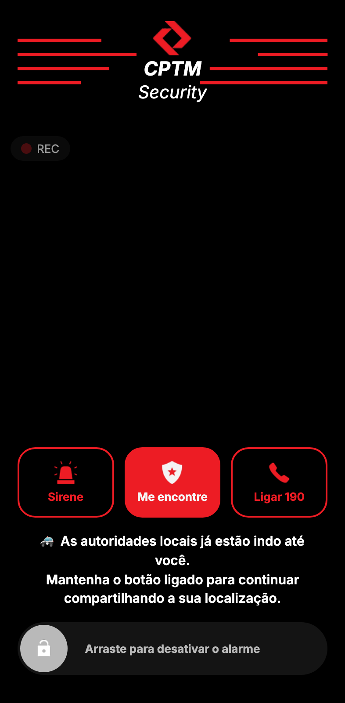
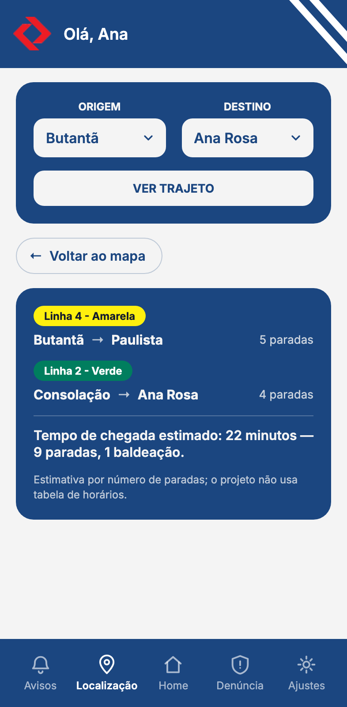

# CPTM SOS

Redesenho do aplicativo da CPTM com um acréscimo que não existe no app real: um
fluxo de emergência pensado para quem se sente inseguro dentro do trem ou na
estação.

Projeto Integrador do Ibmec. O recorte nasceu de reclamações reais de usuárias da
CPTM, trabalhadas em double diamond e personas com orientação do professor de
design.

| | | | |
|---|---|---|---|
|  |  |  |  |
| Entrada | Início | Alarme acionado | Trajeto |

---

## Como rodar

Só é preciso Node. Não há banco para instalar, nem serviço externo.

```bash
npm install
echo "JWT_SECRET=$(node -e "console.log(require('crypto').randomBytes(32).toString('hex'))")" > .env
npm run dev
```

O app sobe em `http://localhost:5001`. O banco local nasce sozinho a partir de
`data/usuario.seed.json` na primeira execução.

Para abrir no celular, use o IP da máquina na mesma rede — `http://192.168.x.x:5001`.

**Conta de demonstração:** `ana.souza@example.com` / `demo1234`. Subindo com
`LOGIN_DEMO=1 npm run dev`, a tela de login ganha um botão que entra direto.

```bash
npm test        # 93 testes de API
npm run test:e2e    # 118 testes de ponta a ponta, com axe-core
npm run test:all
```

---

## O diferencial: o fluxo de emergência

É o motivo de o projeto existir, e é onde estão as decisões mais difíceis.

**Acionar.** A tela de pré-denúncia leva ao alarme. Ali há três ações: a sirene,
o "Me encontre" e o "Ligar 190" — este último disca de verdade, pelo telefone,
sem passar pelo app.

**Ser encontrada.** O "Me encontre" acompanha a posição enquanto a pessoa se move
(`watchPosition`, não uma leitura única — metade de uma viagem de trem é túnel e
estação coberta, e o sinal vai e volta). A confirmação de que há ajuda a caminho
**só aparece depois que chega uma posição de verdade**: prometer socorro a quem o
app não conseguiu localizar seria o pior erro possível nesta tela.

**Desligar.** Só com o CPF de quem está logado. E desligar apaga a última posição
guardada no servidor, além de encerrar a sirene, o GPS e a câmera no aparelho —
explicitamente, não como efeito colateral de a tela ser fechada.

**Denunciar.** A denúncia é anônima de verdade no armazenamento: ela vai para
`data/denuncias.json`, um arquivo separado, e não fica aninhada no registro de
quem a fez. Uma denúncia guardada dentro do usuário não teria nada de anônima.

---

## Decisões que valem explicar

**Identidade vem do token, nunca do corpo da requisição.** Toda rota protegida
descobre quem está falando pelo JWT. Se o cliente mandasse o próprio id, bastaria
trocá-lo para mexer na conta alheia. O teste mais importante da suíte é esse:
confirmar o alarme de outra pessoa, com o CPF correto dela e um token válido do
atacante, tem de falhar.

**A resposta do login não revela se o e-mail existe.** E o log do servidor
também não — ele chegou a distinguir "e-mail não encontrado" de "senha
incorreta", desfazendo no arquivo o cuidado que a resposta tomava.

**Nada de dado pessoal nas respostas.** Um `usuarioPublico()` monta o que sai da
API campo a campo. A versão anterior espalhava o objeto inteiro tirando a senha,
e passou a vazar a localização GPS assim que ela foi adicionada ao usuário.

**Arquivos estáticos por lista de permissão.** Servir a raiz e bloquear o que é
sensível não funciona: um bloqueio por prefixo é furado por `//data/x`,
`/data%2Fx` e `/./data/x`. Só as pastas de recursos e as páginas `.html` da raiz
são servidas — o resto não existe para o mundo.

**A posição guardada expira em 6 horas.** Ninguém precisa saber onde alguém
esteve ontem.

**A rota entre estações é calculada aqui.** Antes vinha de um script Python que
dependia de um ambiente virtual à parte e desenhava as estações em coordenadas
inventadas por uma simulação de forças, sobre um mapa real de São Paulo — parecia
autoritativo e era ficção. Hoje é uma busca de menor caminho sobre as 13 linhas e
176 estações, em TypeScript, sem dependência nenhuma.

---

## O que é simulado

O app é um protótipo acadêmico. Estas partes têm a aparência da coisa real e não
são a coisa real:

- **O acionamento das autoridades.** O app registra e compartilha a localização,
  mas não notifica ninguém. Nenhuma central recebe o alerta.
- **Recarga e compra de bilhetes.** Não há gateway de pagamento. O saldo muda no
  app, nenhum valor é cobrado.
- **O QR code.** É uma imagem fixa, igual para todos: não é gerado, não codifica a
  conta e nenhuma rota lê código. Quem desconta a tarifa é o botão da tela, que
  por isso diz o que faz — "Simular a catraca lendo o código".
- **O tempo de viagem.** Estimado por número de paradas e baldeações, não por
  tabela de horários. A tela diz isso.

---

## Acessibilidade

`axe-core` roda sobre as doze telas na suíte de ponta a ponta, e a barra é
`wcag2a` + `wcag2aa` + `wcag21a` + `wcag21aa`. Foi assim que apareceram, e foram
corrigidos, `lang="en"` em página portuguesa, campo sem rótulo e `div` clicável
inalcançável pelo teclado.

Além do que a ferramenta pega, há testes para o que ela não pega: alvo de toque
mínimo de 24×24 (os indicadores do carrossel tinham 8×8), o foco que não escapa
das camadas modais para a página atrás, a pinça de ampliar preservada em todas as
telas, e o teclado alcançando os fluxos que dependiam de controles improvisados —
as categorias da denúncia, os seletores do mapa e a folha de ajuda eram `div`
clicáveis, inalcançáveis sem mouse.

**Uma exceção, consciente.** O vermelho institucional da CPTM (`#ED1C24`) com
texto branco dá 4,38:1, abaixo dos 4,5:1 que a WCAG AA pede. Vale para cinco
elementos: o "Entrar" do login e o do apelido, o "Cadastrar", e o "Recarga" e o
"Usar QR Code" do cartão de saldo. Manter foi decisão
de marca do grupo, com o número na mesa — a alternativa medida, `#D3141A`, dá
5,41:1 e muda o tom. A regra **não** foi desligada por causa disso: ela roda, e
só esses cinco elementos são aceitos pelo nome. Um sexto reprova a suíte.

---

## Testes

93 testes de API (`node:test`) e 118 de ponta a ponta (Playwright).

Mais do que a contagem, importa que eles peguem regressão. Ao longo do trabalho
cada correção foi verificada por mutação — quebrar de propósito o que acabou de
ser consertado e conferir que a suíte reprova. Foi assim que se descobriu que
alguns testes não valiam nada: um media a caixa que continha o cartão em vez do
cartão, e passava com o defeito de volta.

Alguns testes guardam invariantes, não implementações. "Se o bloco precisa rolar,
ele tem de receber o toque" pega um defeito que só aparece no WebKit, e que um
teste de rolagem no Chromium jamais reprovaria.

---

## Estrutura

```
assets/src/     servidor (TypeScript), cálculo de rota, dados das linhas
assets/css/     uma folha por tela + as compartilhadas (base, cabeçalho, navegação)
assets/js/      um script por tela + os compartilhados (auth, formulário, confirmação)
data/           banco local em JSON; o seed é versionado, o banco não
tests/          testes de API
e2e/            testes de ponta a ponta
docs/figma/     telas do projeto visual, para comparar com o que foi construído
docs/telas/     capturas do app como ele está
```

---

## Evolução conhecida

**Mapa interativo da rede.** O obstáculo é dado, não código: `estacoes.json` traz
nome, sequência e conexões das 176 estações, mas **nenhuma coordenada**. Um
diagrama de transporte é artefato de design — posicionar as estações, definir
ângulos e evitar colisão de rótulos é trabalho manual, não geração automática.

**Aplicação de página única.** Cada tela é um documento próprio, e trocar de tela
recarrega tudo. A transição entre documentos (`@view-transition`) resolve o que se
vê, mantendo as barras paradas enquanto só o miolo troca — mas não é o mesmo que
uma SPA, e o documento continua sendo recarregado por baixo.

**QR code de verdade.** Um token assinado de curta duração por usuário, desenhado
no cliente, e uma rota que o valida e debita, com proteção contra reuso.

**Tela de ajustes.** Existe no projeto visual e na barra de seções, mas nunca foi
construída — está marcada como indisponível. O app também não tem "sair da conta"
em lugar nenhum.

---

## Autoria

Trabalho coletivo do grupo **Paraíso Feudal** — Benjamin, João Pedro, Paulo,
Thales, Thomas e Waldir.
